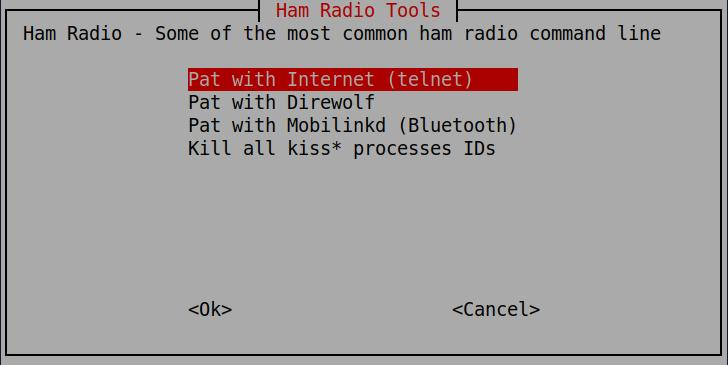

# Ham

Several Linux ham radio apps require multiple commandline executions.  Here I've created a script to run the various configurations I might want to run on when in the field or at home.

This is a Bash script, developed on Xubuntu, so should work on most any Debian based system.

Uses whiptail to create a nice menu.

## Basic Use

Options are:

* Pat with Internet (telnet)
* Pat with Direwolf
* Pat with Mobilinkd (Bluetooth)
* Kill all kiss* processes IDs



## Icon and Desktop file

For many Debian based systems, edit then copy the ham.desktop file to ~/.local/share/applications/ so you can run this from the GUI menu system.

```bash
cp ham.desktop ~/.local/share/applications/
```

